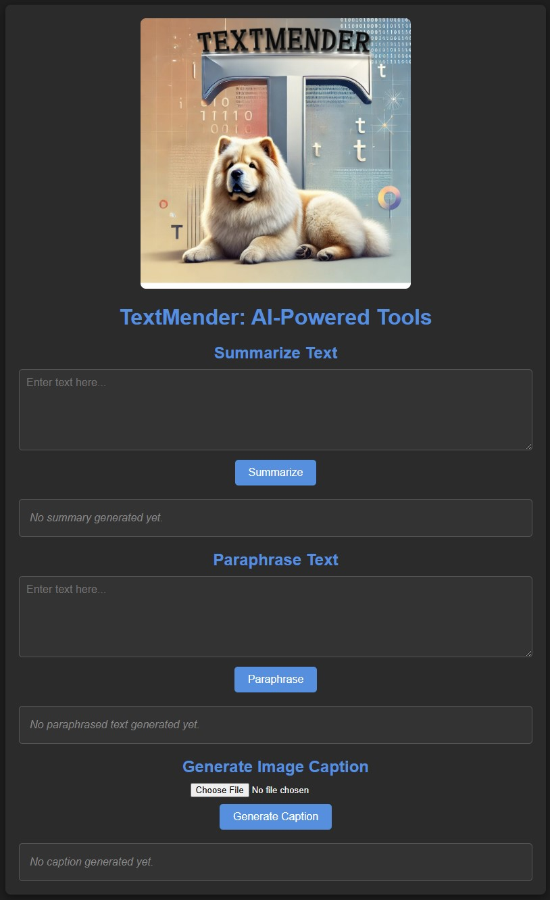

<h1 align="center">TextMender: User Guide and README</h1>
<p align="center">
  
</p>

# Welcome to TextMender

TextMender is a **completely _FREE_**, locally-run web application for text summarization, paraphrasing, and image captioning. Leveraging state-of-the-art language models from Hugging Face’s Transformers library, TextMender is designed to process text and images effectively, ensuring privacy by running entirely on your **local machine**. No data is sent to external servers, giving you full control over your content.

---

## **New Features**
1. **Text Summarization**: Condense large pieces of text into concise summaries.
2. **Paraphrasing**: Rephrase text while preserving the original meaning.
3. **Image Captioning**: Generate captions for uploaded images using AI.

---

## **Setting Up Your Environment**

### **Prerequisites**
- **Python**: 3.7 or higher
- **Memory**: Minimum of 8GB of RAM for optimal performance
- **Browser**: Chrome, Firefox, or any modern browser

### **Installation**

1. **Clone the Repository**: Clone the TextMender GitHub repository to your local machine:

    ```bash
    git clone https://github.com/aelyader/TextMender.git
    ```

    Navigate to the cloned directory:

    ```bash
    cd TextMender
    ```

2. **Set Up the Environment Using Conda**:

    Use the provided `.yml` file to create the environment with all dependencies:

    ```bash
    conda env create -f environment.yml
    ```

    Activate the newly created environment:

    ```bash
    conda activate textmender-env  # Replace 'textmender-env' with the environment name specified in environment.yml
    ```

3. **Verify Installation**:  
   Ensure all packages are installed correctly by confirming the environment is active.

4. **Download the Models**:  
   The necessary NLP models (BART for summarization, T5 for paraphrasing, and BLIP for image captioning) are downloaded automatically on the first run. Ensure an internet connection is available for the initial download.

---

## **Running TextMender**

1. **Start the Flask Server**:

    ```bash
    python app.py
    ```

2. **Access the Application**:  
   Open your browser and go to [http://127.0.0.1:5000](http://127.0.0.1:5000) to access TextMender.

---

## **Using TextMender**

### **1. Summarize Text**
   - Input your text in the **Summarize Text** section.
   - Click **Summarize** to generate a concise version of the input text.

### **2. Paraphrase Text**
   - Input your text in the **Paraphrase Text** section.
   - Click **Paraphrase** to generate a rephrased version of the text.

### **3. Generate Image Caption**
   - Upload an image in the **Generate Image Caption** section.
   - Click **Generate Caption** to display an AI-generated description of the uploaded image.

### **Output Display**
   - The output for each feature is displayed directly below its respective section for easy access.

---

## **Technical Details**

- **Backend**: Flask framework for web server functionality.
- **Frontend**: HTML and CSS for user interface.
- **Models**:
  - **Summarization**: Uses `facebook/bart-large-cnn` for generating summaries.
  - **Paraphrasing**: Uses `t5-small` for generating paraphrased text.
  - **Image Captioning**: Uses `Salesforce/blip-image-captioning-base` for generating captions from images.
- **Dynamic Length Handling**:
  - Summarization and paraphrasing dynamically adjust output length based on input size for coherence and readability.
  - Image captioning allows up to 50 tokens for captions to maintain concise descriptions.
- **Key Libraries**:
  - **Transformers**: For pre-trained NLP and image models.
  - **Flask**: For serving the web application.
  - **Pillow**: For image processing.

---

## **Troubleshooting**

- **Model Load Issues**: Ensure a stable internet connection for the initial model downloads.
- **File Type Restrictions**: Only `.jpg` and `.png` files are supported for image captioning. Ensure your uploaded image is in a valid format.
- **Performance**: If you experience slow performance, close other applications or upgrade your hardware.
- **Display Issues**: If results are misaligned, check that `white-space: pre-wrap;` is applied to the output sections in the HTML.

---

## **TextMender Output**

TextMender does not generate downloadable output files but displays results directly in the web interface. You can manually copy the output for further use.

### **1. Summary Output**
   - Condensed summary based on the input text.

### **2. Paraphrased Text Output**
   - Rephrased text preserving original meaning.

### **3. Generated Caption**
   - AI-generated caption describing the uploaded image.

---

## **Additional Notes**

- **Preserving Line Breaks**: TextMender’s output preserves formatting and line breaks for better readability.
- **Production Deployment**: For public use, deploy with a production-grade WSGI server like Gunicorn or uWSGI. For local use, the development server is sufficient.

---

<p align="center">
  
</p>

For issues or further assistance, please refer to the GitHub issues page or contact the development team.

---

## **Contributors**
- **Amir Elyaderani** - Initial development and project management

---

### **Updated Features**
This updated version introduces AI-powered **image captioning**, making TextMender a versatile tool for text and image processing. Let us know your feedback or suggestions to improve the application further!
